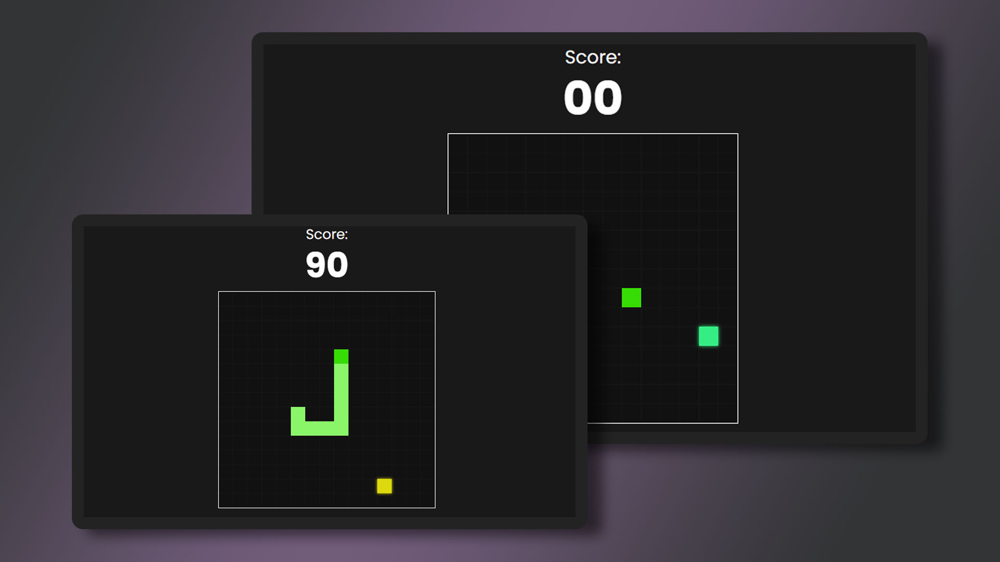

# snake-game

<h1 align="center"> Snake Game </h1>

O clássico "jogo da cobrinha" para desktop, desenvolvido com HTML, CSS e JavaScript.

 

  

## 🚀 Tecnologias

Esse projeto foi desenvolvido com as seguintes tecnologias:

- HTML e CSS
- JavaScript
- Git e Github

## ☝️ Desenvolvimento

Com o HTML enxuto, foi possível restringir o uso do CSS e criar um projeto destinado ao estudo da programação, trabalhando com variáveis, funções e tags de "canvas", utilizando desenhos gráficos no JavaScript (context2D), além de estudar o vínculo da movimentação do personagem ao teclado do computador.
Em razão disso, foi possível desenvolver um jogo de navegador capaz de reconhecer a margem de colisão da "cobrinha", apresentando ao usuário sua pontuação obtida e a alternativa de recomeçar o jogo.

## 📱✅ Responsividade

O jogo possui responsividade e é possível utilizá-lo em celulares e tablets. Através do "@media screen" no CSS, elementos ID do HTML e constantes do JavaScript, foi possível atualizar a movimentação da cobrinha conforme o tamanho da tela, seja para teclas no computador ou setas para mobile.